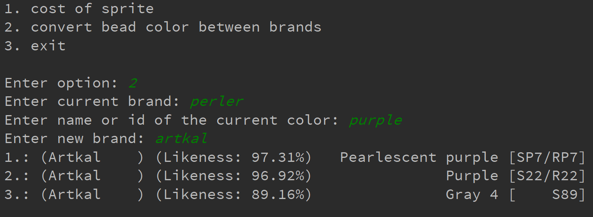

# Bead Helper
A simple cli tool for python 3.7+ 
The goal is to help with the planning and resource cost of Perler (Fuse) Bead projects.
### Its' current features are:
- Converting colors between bead brands
- Analysing an image to produce the bead colors and quantities needed for 'beading' that design

# Dataset Source
The dataset was sourced from [here.](https://docs.google.com/spreadsheets/d/1f988o68HDvk335xXllJD16vxLBuRcmm3vg6U9lVaYpA)
Created by: (Reddit User) [u/LThanda](https://www.reddit.com/user/LThanda)

# Example
